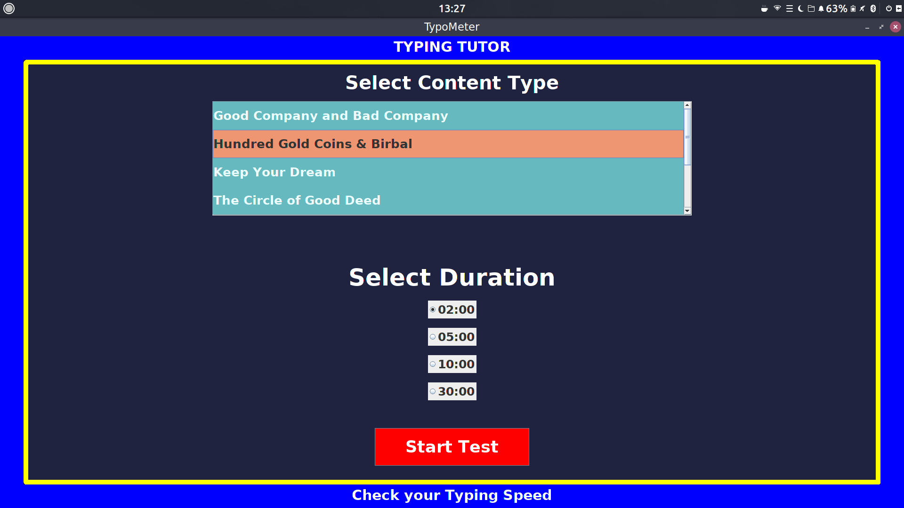
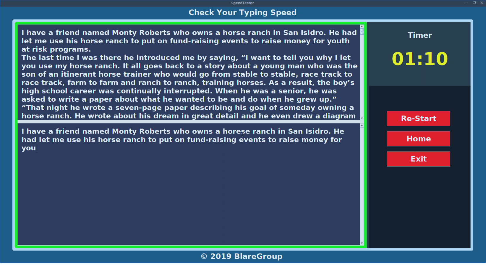
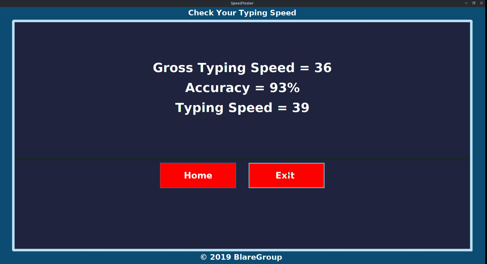

# SpeedTester
SpeedTester is Typing tool which helps to you to check and increase your typing speed and accuracy.

---

## How to use
For using this your system must have java installed. After that simply compile SpeedTester.java and then run then SpeedTester. Your SpeedTester is now dispayed.

## Commands

    -javac SpeedTester.java
    -java SpeedTester

##  Preview

---

---

### Developers/Author
- Himanshu Sharma - (himanshusharma2972@gmail.com) [BlareGroup](www.blaregroup.com)

